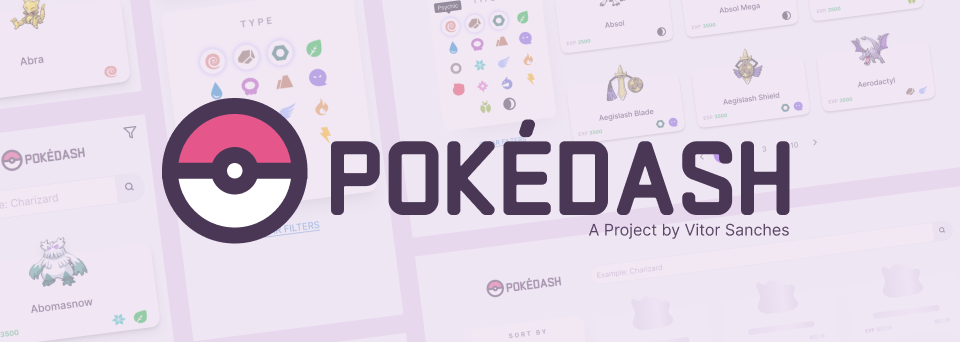
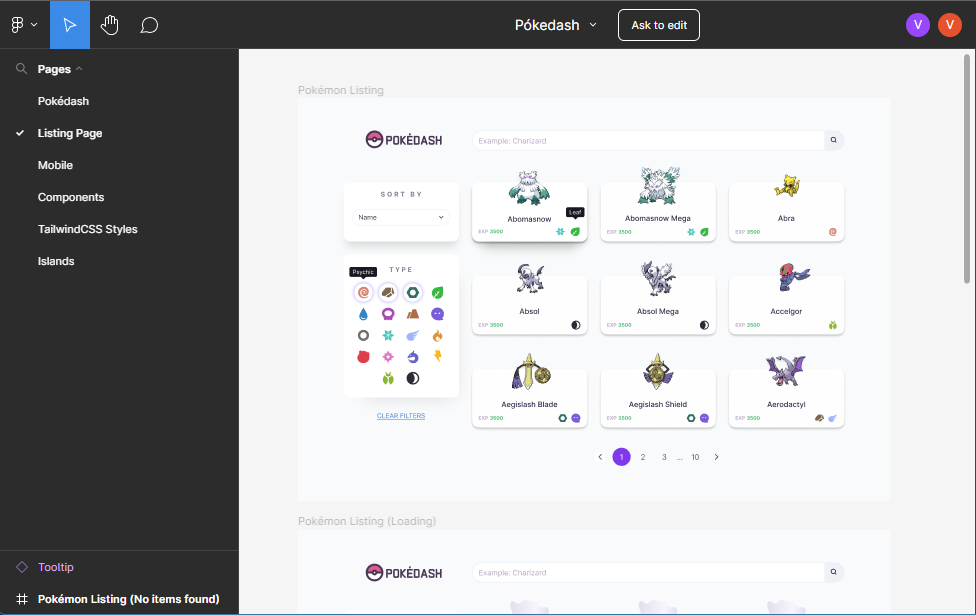
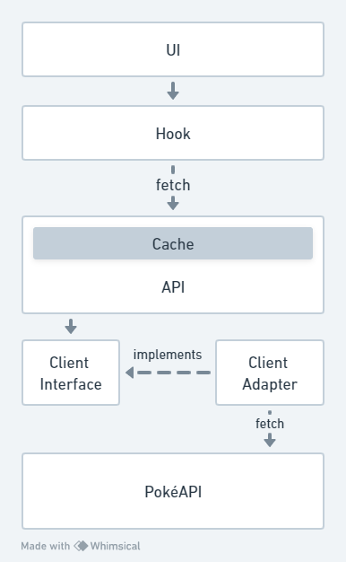
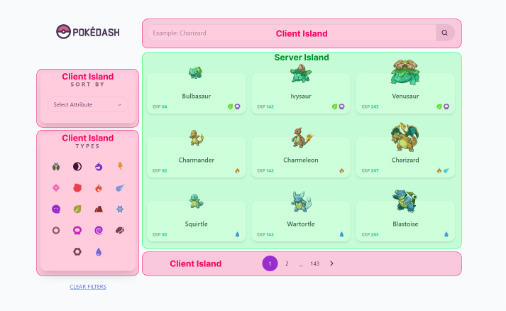

# Pokédash

This is a Pokémon Dashboard built with NextJS

[](https://pokedash-snx.vercel.app)

## This project was built with


## See it running

You can see it running at [pokedash-snx.vercel.app](https://pokedash-snx.vercel.app)

The storybook component documentation is also available at [vitorxfs.github.io/pokedash](https://vitorxfs.github.io/pokedash)

## Running Locally

1. Fork this repository
2. Clone or download the forked project
3. Run
```
pnpm install
pnpm run dev
```

For building, run
```
pnpm run build
pnpm run postbuild
```

The script `postbuild` will create the sitemap as well as the `robots.txt` file for SEO.

The boilerplate used for this project can be found at [vitorxfs/next-blank-app](https://github.com/vitorxfs/next-blank-app/tree/app-directory)

## Project Design

The design of this project can be found on [this figma file](https://www.figma.com/file/XHKiJX15RLhqRNhR0l57CK/P%C3%B3kedash).



## Project Structure

```
src/
|--app/
|  '-api/
|--components/
|--config/
|--data-types/
|--helpers/
|--hooks/
|--layout/
|--lib/
|  |-clients/
|  |-components/
|  '-next/
|--styles/
|--env.ts
'--factories.ts
```

- `factories.ts` centralizes the classes instantiation
- `env.ts` exports environment variables

### Data flow



### Island Architecture

Based on [this Jason Miller post about the Island Architecture](https://jasonformat.com/islands-architecture/), the listing page was divided in five islands: four interactive client-side islands, that updates the URL query parameters; and one static server island, which is the listing itself.


